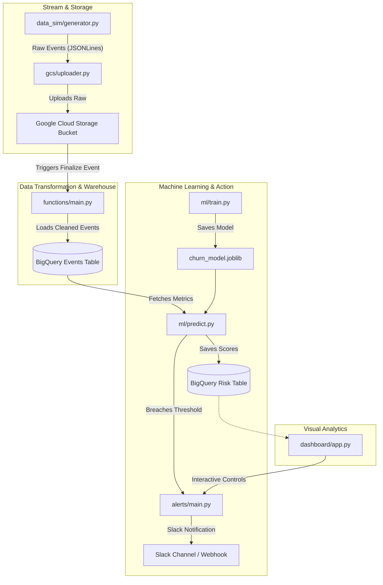

# Churn Revenue-Risk Predictor with Automated Intervention Pipeline

An end-to-end Python-based data pipeline that generates synthetic streaming events, uploads data to Google Cloud Storage (GCS), transforms it via GCP Cloud Functions, loads it to BigQuery, trains a Churn Classification ML model, calculates Revenue-at-Risk, dispatches Slack notification alerts, and provides a real-time monitoring Streamlit dashboard.

---

## Project Structure

```
├── .env.example            # Placeholders for required environment variables
├── .gitignore              # Ignores venvs, local credentials, and .env files
├── requirements.txt        # Root project dependencies
├── README.md               # Setup and execution guide (this file)
│
├── shared/
│   └── logging_config.py   # Unified logging format across all modules
│
├── data_sim/
│   └── generator.py        # Synthetic customer event stream generator
│
├── gcs/
│   └── uploader.py         # Google Cloud Storage upload utility
│
├── functions/
│   ├── main.py             # Cloud Function: Transforms & cleans raw GCS files to BQ
│   └── requirements.txt    # Cloud Function specific requirements
│
├── bigquery/
│   ├── schema.json         # BQ schema configs for events and churn_risk
│   └── loader.py           # BQ schema manager & batch/stream load utility
│
├── ml/
│   ├── train.py            # Model training (Scikit-Learn Random Forest)
│   ├── predict.py          # Revenue-at-risk scoring and alerts dispatcher
│   └── churn_model.joblib  # Trained model artifact (created after training)
│
├── alerts/
│   ├── main.py             # Cloud Function: Slack Hook notifier & mock fallbacks
│   └── requirements.txt    # Alerts function requirements
│
├── dashboard/
│   └── app.py              # Streamlit dashboard for real-time monitoring
│
└── tests/
    └── test_pipeline.py    # Automated test cases
```

---

## Architecture Overview



---

## Setup Instructions

### 1. Create and Activate Virtual Environment
```bash
# Create virtual environment
python -m venv .venv

# Activate (Windows PowerShell)
.\.venv\Scripts\Activate.ps1

# Activate (Windows Cmd)
.\.venv\Scripts\activate.bat

# Activate (Linux/macOS)
source .venv/bin/activate
```

### 2. Install Dependencies
```bash
pip install -r requirements.txt
```

### 3. Environment Variables
Copy `.env.example` to `.env` and fill in the values:
```bash
cp .env.example .env
```
Ensure you provide a valid `GOOGLE_APPLICATION_CREDENTIALS` path pointing to your GCP Service Account JSON key if integrating with live GCP resources.

---

## Usage Guide

### 1. Synthetic Event Generator
Generate synthetic streaming customer events and output them to a local JSON Lines file:
```bash
python data_sim/generator.py --customers 100 --duration 15 --rate 5 --output data_sim/events.json
```

### 2. GCS Uploader
Upload the generated events log file to GCS:
```bash
python gcs/uploader.py --source data_sim/events.json --destination raw-events/events.json
```

### 3. BigQuery Ingestion Setup
Create the BigQuery dataset and tables from schemas defined in `bigquery/schema.json`:
```bash
python bigquery/loader.py --setup
```

Load your generated event file into the BigQuery events table:
```bash
python bigquery/loader.py --load-file data_sim/events.json --table events
```

### 4. ML Pipeline (Training & Scoring)
Train the random forest classification model on synthetic historical data:
```bash
python ml/train.py
```
This saves `churn_model.joblib` inside the `ml/` folder.

Generate churn risk probabilities and calculate revenue-at-risk for current customers:
```bash
python ml/predict.py
```
This saves risk metrics locally at `output/churn_risk_scores.csv` and ingests them to the BigQuery `churn_risk` table if GCP variables are configured in `.env`.

### 5. Streamlit Dashboard
Run the analytics dashboard locally:
```bash
streamlit run dashboard/app.py
```
This launches a browser tab (typically at `http://localhost:8501`) displaying active customer risk stats, interactive visuals, and alert triggers.

---

## Testing

Run automated tests:
```bash
pytest tests/
```
