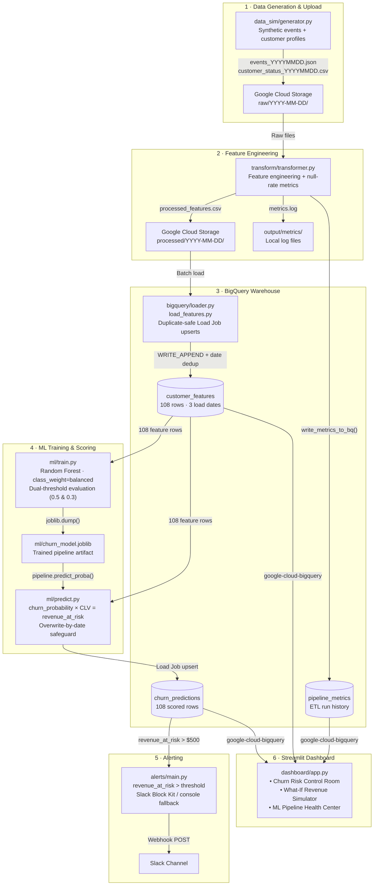

# Churn Revenue-Risk Predictor with Automated Intervention Pipeline

An end-to-end Python pipeline that ingests synthetic customer event streams, engineers churn-predictive features, trains a balanced Random Forest classifier, scores customers by **revenue at risk**, and surfaces everything in a real-time Streamlit dashboard — all backed by Google Cloud Storage and BigQuery.

---

## Architecture



---

## Project Structure

```
├── .env.example                      # Required environment variable template
├── .gitignore
├── requirements.txt                  # Root project dependencies
├── README.md
│
├── shared/
│   └── logging_config.py             # Unified structured logger (all modules)
│
├── data_sim/
│   └── generator.py                  # Synthetic customer events + profiles generator
│
├── gcs/
│   └── uploader.py                   # Google Cloud Storage upload utility
│
├── transform/
│   └── transformer.py                # Feature engineering pipeline + BQ metrics writer
│
├── bigquery/
│   ├── schema.json                   # Table schemas for all BQ tables
│   ├── loader.py                     # BQ client factory + Load Job ingestion helpers
│   ├── load_features.py              # Date-deduplicating feature loader
│   └── backfill_pipeline_metrics.py  # One-shot backfill from local metrics .log files
│
├── ml/
│   ├── train.py                      # Random Forest training, dual-threshold evaluation
│   ├── predict.py                    # Scoring: churn_probability → revenue_at_risk
│   └── churn_model.joblib            # Trained model artifact (generated on first run)
│
├── alerts/
│   ├── main.py                       # Revenue-at-risk alerting (Slack / console)
│   └── requirements.txt
│
├── dashboard/
│   └── app.py                        # Streamlit: 3-tab analytics dashboard
│
├── output/
│   ├── daily_streams/                # Raw synthetic files (local mode)
│   ├── processed/                    # Transformed CSVs (local mode)
│   └── metrics/                      # Per-run metrics logs (metrics_YYYY-MM-DD.log)
│
├── functions/
│   ├── main.py                       # Cloud Function entry point (optional GCS trigger)
│   └── requirements.txt
│
└── tests/
    └── test_pipeline.py              # 17 unit tests covering all pipeline stages
```

---

## Setup Instructions

### 1. GCP Project & Service Account

1. Create a GCP project at [console.cloud.google.com](https://console.cloud.google.com)
2. Enable the following APIs:
   - BigQuery API
   - Cloud Storage API
3. Create a **Service Account** with these roles:
   - `BigQuery Data Editor`
   - `BigQuery Job User`
   - `Storage Object Admin`
4. Download the Service Account JSON key and save it to your project root (e.g. `my-key.json`)
5. Create a GCS bucket and a BigQuery dataset (e.g. `churn_pipeline`)

### 2. Create & Activate Virtual Environment

```bash
# Create
python -m venv .venv

# Activate — Windows PowerShell
.\.venv\Scripts\Activate.ps1

# Activate — Linux / macOS
source .venv/bin/activate
```

### 3. Install Dependencies

```bash
pip install -r requirements.txt
```

### 4. Configure Environment Variables

```bash
cp .env.example .env
```

Edit `.env` with your values:

```ini
GOOGLE_APPLICATION_CREDENTIALS="C:/path/to/your/service-account-key.json"
GCP_PROJECT_ID=your-gcp-project-id
GCS_BUCKET_NAME=your-gcs-bucket-name
BIGQUERY_DATASET=churn_pipeline

# Optional — Slack alerting
SLACK_WEBHOOK_URL=https://hooks.slack.com/services/...
ALERT_REVENUE_THRESHOLD=500
```

### 5. Initialise BigQuery Tables

```bash
python -m bigquery.loader --setup
```

---

## Usage Guide

### Step 1 — Generate Synthetic Data

```bash
# Generate events and profiles for a target date (local mode)
python -m data_sim.generator --date 2026-07-03 --customers 33
python -m data_sim.generator --date 2026-07-04 --customers 36
python -m data_sim.generator --date 2026-07-05 --customers 39
```

### Step 2 — Transform Features

```bash
# Runs feature engineering and writes metrics to BQ automatically
python -m transform.transformer --date 2026-07-03 --local
python -m transform.transformer --date 2026-07-04 --local
python -m transform.transformer --date 2026-07-05 --local
```

### Step 3 — Load Features to BigQuery

```bash
# Deduplication-safe: skips dates already loaded
python -m bigquery.load_features --date 2026-07-03
python -m bigquery.load_features --date 2026-07-04
python -m bigquery.load_features --date 2026-07-05
```

### Step 4 — Train the ML Model

```bash
python -m ml.train
```

Outputs detailed evaluation metrics to the console (see **Results** below) and saves `ml/churn_model.joblib`.

### Step 5 — Score Customers & Write Predictions

```bash
python -m ml.predict
```

Reads all 108 feature rows, scores each customer, and writes `churn_predictions` to BigQuery with an overwrite-by-date safeguard.

### Step 6 — Run Alerts (optional)

```bash
python -m alerts.main
```

Queries `churn_predictions` for `revenue_at_risk > $500` and posts a Slack summary block (falls back to formatted console output if no webhook is configured).

### Step 7 — Launch Dashboard

```bash
python -m streamlit run dashboard/app.py
```

Opens at [http://localhost:8501](http://localhost:8501) with three tabs:
- **Churn Risk Control Room** — revenue exposure bubble chart, top-20 at-risk table, historical trend
- **What-If Simulator** — slider-based intervention revenue recovery calculator
- **ML Pipeline Health** — model metrics card, ETL run history from `pipeline_metrics`

### Backfill Historical Metrics (if needed)

If `pipeline_metrics` is missing historical rows (e.g. runs done before the BQ writer was added):

```bash
python -m bigquery.backfill_pipeline_metrics
```

---

## Testing

```bash
pytest tests/ -v
```

17 unit tests cover: data generation, feature engineering, loader deduplication, model training, scoring, and alert triggering.

---

## Key Design Decisions

### Revenue-at-Risk Instead of Raw Churn Probability

Raw churn probability treats a $50/month customer the same as a $800/month customer. This pipeline computes:

```
revenue_at_risk = churn_probability × customer_lifetime_value
```

This allows the business to **rank customers by economic impact**, not just risk score. A customer with 30% churn probability and $10,000 CLV (risk = $3,000) should be prioritised over a customer with 60% probability and $200 CLV (risk = $120). The `churn_predictions` table and the dashboard Top-20 table are both sorted by `revenue_at_risk` descending.

### Dual-Threshold Evaluation (0.5 vs 0.3)

The model is evaluated at two classification thresholds, both reported in the training output and the dashboard:

| Threshold | Precision | Recall | F1  | Use case |
|-----------|-----------|--------|-----|----------|
| **0.5** (default) | 100% | 66.7% | 80% | High-confidence interventions — every flagged customer is genuinely at risk |
| **0.3** (recommended) | 25% | 100% | 40% | Catch-all net — never miss a churner, accept more false positives |

For a **churn intervention business use case**, the cost of a missed churner (lost revenue permanently) almost always exceeds the cost of a false alarm (one unnecessary retention offer). Threshold 0.3 is therefore the operationally preferred setting, even though its precision is lower. The ROC-AUC of **0.9583** is threshold-independent and confirms the model's overall ranking power.

### `class_weight='balanced'` in the Random Forest

With only ~11% churn rate in the dataset (≈12 churned customers out of 108), an unweighted classifier learns to predict "Active" for every customer and achieves 89% accuracy while completely failing to detect any churners. `class_weight='balanced'` instructs scikit-learn to automatically up-weight the minority class (churned) inversely proportional to its frequency:

```
weight(churned) ≈ 108 / (2 × 12) ≈ 4.5×
```

This forces the trees to treat a wrong churn prediction as 4.5× more costly than a wrong active prediction, yielding meaningful Precision/Recall/F1 scores even on a small, imbalanced dataset.

---

## Results

### Model Performance (Random Forest, 108 rows, 25% test split)

| Metric | Value |
|--------|-------|
| ROC-AUC | **0.9583** |
| Precision @ 0.5 | 100.00% |
| Recall @ 0.5 | 66.67% |
| F1 @ 0.5 | 80.00% |
| Precision @ 0.3 | 25.00% |
| Recall @ 0.3 | 100.00% |
| F1 @ 0.3 | 40.00% |

Training split: **81 samples** (72 active, 9 churned)  
Test split: **27 samples** (24 active, 3 churned)

### Top Revenue-at-Risk Findings (2026-07-06 scoring run · 39 unique customers)

| Customer ID | Churn Probability | Revenue at Risk |
|-------------|-------------------|-----------------|
| 9933-QRGTX  | 0.950             | $7,314.87       |
| 3146-MSEGF  | 0.444             | $3,562.18       |
| 7564-GHCVB  | 0.467             | $3,366.77       |
| 7233-PAHHL  | 0.421             | $3,013.73       |
| 9489-DEDVP  | 0.329             | $2,033.27       |
| 0794-YVSGE  | 0.877             | $1,622.72       |
| 5693-PIPCS  | 0.241             | $1,448.14       |
| 6465-GSRCL  | 0.149             | $1,234.07       |
| 4194-FJARJ  | 0.274             | $1,201.65       |
| 5206-XZZQI  | 0.263             | $1,125.19       |

> Each customer appears exactly once — the scorer deduplicates across all `load_date` partitions, keeping the highest `revenue_at_risk` snapshot per customer.

### ETL Pipeline Health (3 runs)

| Run Date | Records In | Records Out | Null Rate |
|----------|-----------|-------------|-----------|
| 2026-07-03 | 33 | 33 | 0.00% |
| 2026-07-04 | 36 | 36 | 0.00% |
| 2026-07-05 | 39 | 39 | 0.00% |

Zero null rates across all 9 feature columns across all 3 days.

---

## Environment Variable Reference

| Variable | Description | Required |
|----------|-------------|----------|
| `GOOGLE_APPLICATION_CREDENTIALS` | Absolute path to GCP service account JSON key | Yes |
| `GCP_PROJECT_ID` | GCP project ID | Yes |
| `GCS_BUCKET_NAME` | GCS bucket for raw and processed files | Yes |
| `BIGQUERY_DATASET` | BigQuery dataset name (e.g. `churn_pipeline`) | Yes |
| `SLACK_WEBHOOK_URL` | Incoming webhook URL for Slack alerts | No |
| `ALERT_REVENUE_THRESHOLD` | Minimum `revenue_at_risk` to trigger an alert (default: 500) | No |
